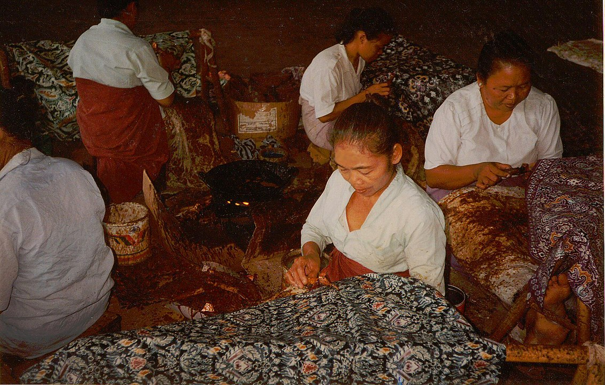

Batik merupakan salah satu warisan budaya yang masih dilestarikan. Bahkan, batik juga sudah memperoleh pengakuan dunia dari United Nations Educational, Scientific, and Cultural Organization (UNESCO) pada 2009.

Batik merupakan kain yang dilukis dari cairan lilin malam dengan menggunakan alat canting yang kemudian melalui proses pewarnaan. Hampir setiap daerah di Indonesia memiliki motif batik yang khas. Setiap motif juga memiliki filosofi sendiri. Ada begitu banyak jenis motif batik yang ada di Indonesia. Lalu, apa saja macam jenis batik yang ada di Nusantara? Yuk, simak selengkapnya di bawah ini.

### 1. Batik Parang Kusumo (Solo)  
Kota Solo mempunyai banyak motif batik kalsik, satu di antaranya ialah motif Parang Kusumo. Batik Parang Kusumo memiliki ragam hias utama menyerupai ombak lautan yang senantiasa menghantam tebing dan karang tanpa kenal lelah.Sesuai analogi tersebut, Parang Kusumo memiliki makna bahwa kehidupan harus dilandasi oleh perjuangan dan usaha. Perjuangan nyata dalam rangka untuk mencapai keharuman lahir dan batin. Bagi orang Jawa, keharuman yang dimaksud keharuman pribadinya tanpa meninggalkan norma dan sopan santun yang berlaku.

### 2. Batik Mega Mendung (Cirebon)
Mega Mendung merupakan satu di antara jenis motif batik yang populer di Cirebon. Motif batik dengan pola-pola awan ini menyimpan filosofi yang mendalam. Pesan nilai kesabaran terselip di balik motif ini. Dalam motif Mega Mendung harus terdapat tujuh gradasi warna yang menjadi pelapis.Gradasi yang ada di motif Mega Mendung tersebut sesuai dengan tujuh lapisan yang ada di langit. Istilah mendung diartikan dalam kehidupan manusia sebagai sifat yang sabar, tidak mudah marah.

### 3. Batik Sidomukti (Solo dan Yogyakarta)
Batik Sidomukti merupakan satu di antara jenis batik keraton Solo, Jawa Tengah. Batik ini biasanya terbuat dari zat pewarna soga alam. Warna soga atau cokelat pada kain sidomukti merupakan warna khas batik klasik dengan motif yang asli dan kuno.Batik Sidomukti memiliki filosofi sesuai namanya. Sidomukti berasal dari kata "sido" yang berarti jadi atau menjadi atau terus menerus sedangkan "mukti" yang berarti mulia dan sejahtera.

### 4. Batik Tujuh Rupa (Pekalongan)
Pekalongan merupakan satu di antara daerah yang terkenal sebagai pengrajin dan pusat batik di Indonesia. Berbagai motif batik yang elegan banyak dihasilkan di kota Pekalongan. Batik Pekalongan merupakan Batik Pesisir yang paling kaya akan warna.Ciri khas batik Pekalongan, yakni didominasi motif tumbuh-tumbuhan dan hewan. Selain memiliki motif bunga yang cerah, ciri lain dari batik Pekalongan ini juga memiliki motif garis dan juga titik pada setiap hasil kerajinan batik tersebut.

### 5. Batik Lasem (Rembang)
Batik Lasem berasal dari Lasem, Kabupaten Rembang, Jawa Tengah. Lasem juga diyakini sebagai daerah yang kali pertama menerima kedatangan warga China di Nusantara pada zaman Laksamana Cheng Ho.Batik ini berbeda dari motif daerah pesisir lainnya. Motif ini memiliki warna yang mencolok. Selain itu memiliki gaya perpaduan yang selaras antara gaya China dengan Jawa. Batik ini merupakan perpaduan dan hasil akulturasi dua budaya. Batik Lasem cenderung didominasi dengan warna merah yang kental dengan nuansa China.

### 6. Batik Singa Barong (Cirebon)
Batik Singa Barong dari Cirebon memiliki makna berdasarkan nama dan sejarahnya, singa barong merupakan sejenis binatang mitologis atau ajaib. Dalam budaya Jawa maupun Bali, kata 'barong' memiliki arti ajaib. Filosofi dari batik Singa Barong Cirebon sebagai wujud simbol-simbol yang bersifat spirititual.

### 7. Batik Sekar Jagad (Solo dan Yogyakarta)
Batik Sekar Jagad merupakan satu di antara batik pedalaman yang berasal dari Solo dan Yogyakarta. Sesuai namanya, Sekar Jagad memiliki arti keindahan yang mampu membuat siapa saja yang melihatnya terpesona."Kar" dalam Bahasa Belanda berarti peta dan "Jagad" dalam Bahasa Jawa berarti dunia, sehingga motif ini melambangkan keberagaman baik di dalam Indonesia maupun di seluruh dunia. Ada yang menyebut bahwa motif Sekar Jagad sebagai peta dunia karena bentuk motifnya menyerupai pulau-pulau.

### 8. Batik Pring Sedapur (Magetan)
Batik Pring Sedapur Magetan merupakan pilihan batik dengan motif sederhana dan simpel. Gambarnya didominasi tanaman pring atau bambu dengan paduan hiasan burung. Meski begitu, batik Pring Sedapur sarat akan makna filosofis. Motif batik ini didominasi gambar-gambar tanaman bambu yang mengandung arti hidup rukun dan tenteram.

### 9. Batik Sidoluhur (Solo) 
Motif Sidoluhur umumnya dipakai pengantin wanita pada saat malam pengantin. Secara harfiah, sido dalam bahasa Jawa memiliki arti jadi atau menjadi.Sedangkan luhur artinya terhormat dan bermartabat sehingga menurut filosofinya, batik Sidoluhur ini menjadi satu di antara bentuk doa sang pemakai agar selalu sehat jasmani rohani serta menjadi orang yang terhormat dan bermartabat.

### 10. Batik Priyangan (Tasikmalaya)
Batik Priyangan Tasikmalaya terkenal dengan ciri khasnya yang memiliki corak yang rapat, rapi, dan berkelas. Dominasi motif rumput dan tumbuh-tumbuhan menjadi identitas utama batik Priyangan.Secara garis besar, batik Tasikmalaya memiliki motif batik yang cenderung memberikan kesan semangat kesederhanaan, terbuka, dan pluralis serta memperlihatkan kesan imut selaras dengan citra umum wanita sunda.

### 11. Batik Kawung
Jenis batik di Indonesia selanjutnya, yakni batik kawung, yang memiliki motif tua dan berasal dari tanah Jawa. Bentuknya seperti kolang-kaling disusun pada empat sudut persegi.Menurut penelitian motif ini sudah ada sejak abad ke-9. Konon, berkembang pada zaman Kesultanan Ngayogyakarta Hadiningrat. Filosofinya, di antaranya adalah pengendalian diri yang sempurna, hati yang bersih tanpa adanya keinginan untuk ria.

### 12. Batik Tambal (Yogyakarta)
Motif Batik Tambal, sesuai namanya, motif ini mempunyai arti menambal sesuatu atau memperbaiki sesuatu yang telah rusak. Pada zaman dahulu, orang- orang percaya bahwa kain ini bisa membantu menyembuhkan orang yang sakit. Caranya juga sangat mudah, yaitu dengan menyelimuti orang sakit tersebut dengan menggunakan kain motif tambal ini.

